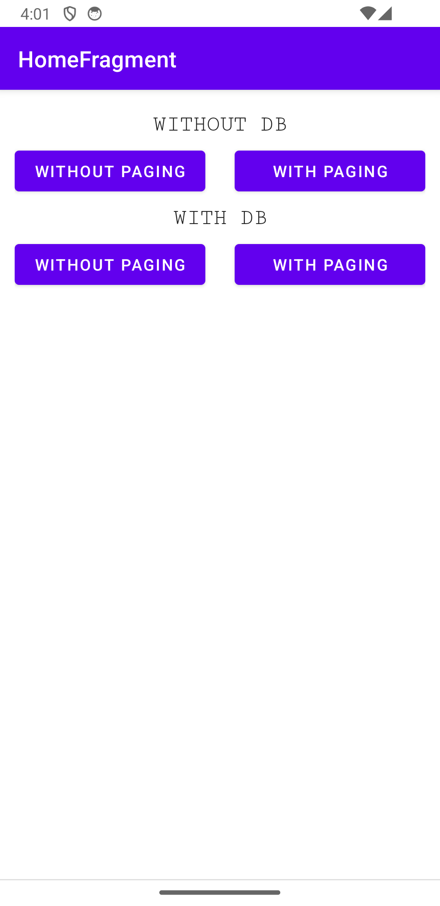
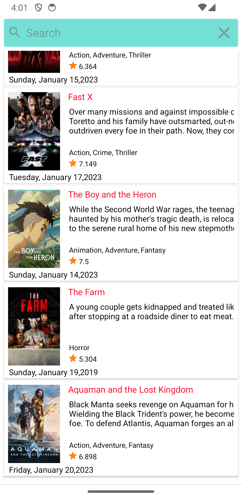
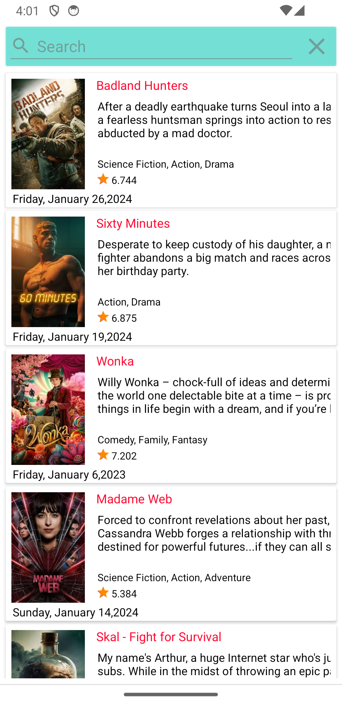
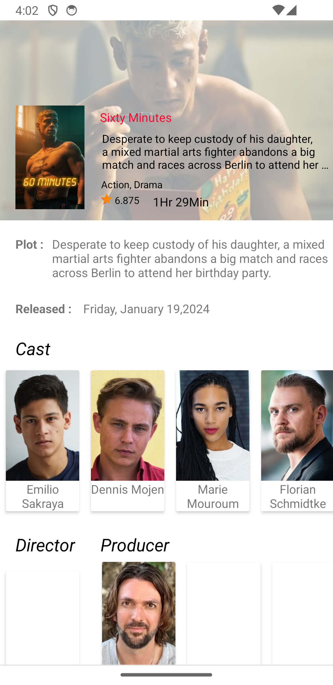

# TMDB-App


## Description

TMDB-App is an Android application focusing on displaying movie information using the TMDB API. It showcases the usage of **Jetpack Pagination** in conjunction with **Room Database** for efficiently loading and displaying large datasets in a paginated manner. The app follows the **MVVM architecture** pattern and utilizes **Coroutines** for asynchronous programming.

### Technologies Used:

- **Kotlin**
- **MVVM**
- **Jetpack Pagination**
- **Room Database**
- **Coroutines**

TMDB-App demonstrates best practices in Android development by leveraging these technologies.

## Screenshots

<!-- Add your screenshot links below -->

 
 

## Table of Contents

- [Installation](#installation)
- [Usage](#usage)
- [Contributing](#contributing)
- [License](#license)

## Installation

1. Clone the repository:
git clone https://github.com/rahulgothwal5/TMDB-App.git
2. Open the project in Android Studio.
3. Obtain a TMDB API key from [The Movie Database](https://www.themoviedb.org/documentation/api).
4. Open the `build.gradle` file in the project level directory.
5. Add your TMDB API key to the `build.gradle` file:
gradle
  ```
  android {
      ...
      buildTypes.each {
          it.buildConfigField 'String', 'TMDB_API_KEY', "\"YOUR_API_KEY\""
      }
  }
  ```
Replace "YOUR_API_KEY" with your actual TMDB API key.
7. Sync the project with Gradle files.
## Usage

Explore the codebase to learn how to develop an Android application using **Jetpack Pagination** in conjunction with **Room Database** for efficiently loading and displaying large datasets. The app fetches movie information from the TMDB API and stores it locally in the database. Asynchronous programming is handled efficiently using **Coroutines**.

## Contributing

1. Fork the repository.
2. Create a new branch (`git checkout -b feature/your-feature-name`).
3. Make your changes.
4. Commit your changes (`git commit -am 'Add new feature'`).
5. Push to the branch (`git push origin feature/your-feature-name`).
6. Create a new Pull Request.

## License

This project is licensed under the [MIT License](LICENSE).

